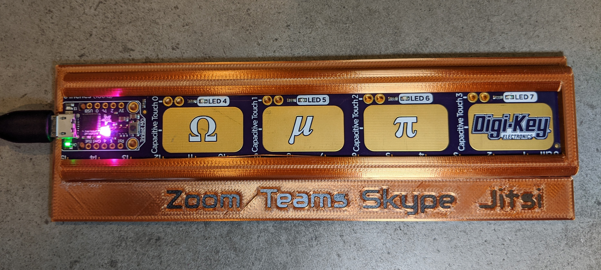

# PyRuler Video Conference Panic Buttons

## Introduction

This project was completely inspired by [Simon Prickett's Zoom Panic Button](https://www.hackster.io/news/a-videoconferencing-panic-button-that-ll-fit-right-in-on-your-desk-c872847dd14e), which allows a user to both mute and cut video at the push of a button. You should also check out his [personal GitHub page](https://github.com/simonprickett).

After seeing his panic button, I thought that would be a great thing to have, and I have plenty of microcontrollers that would do the trick. However, I don't spend a lot of time on Zoom. Most work meetings are on Microsoft Teams or Skype, and personal meetings are on either [Zoom](https://zoom.us/) or [Jitsi](https://github.com/jitsi/jitsi-meet).

Each one of these video conferencing systems uses its own hotkeys for camera and microphone toggling (even Teams and Skype, which I find odd).

So, doing this with multiple systems would require multiple buttons. As it turns out, I had a Trinket M0 *already embedded with four buttons* in the form of an [Adafruit PyRuler](https://www.adafruit.com/product/4319). Even better, it's already pre-programmed as a USB HID device, so it was ready to go as a keyboard entry device.

So, with some small modifications to the included code and a 3D-printing enclosure for the ruler, I give you the PyRuler Video Conference Panic Button(s)!

## Installation

If you have a completely stock PyRuler, installation couldn't be simpler. Just connect the PyRuler to your PC via the USB connection, and replace the code.py file in this repo with the one on the ruler. That's it!

## Making the Enclosure

The enclosure is printed in two parts to make it easy to remove supports from the overhanging groove for the PyRuler.

* PyRuler_Base.stl is the base of the enclosure. For added text contrast, it can be printed in one color up to a height of 2.2mm, and a different one for the rest of the print.
* PyRuler_Base_Blank.stl is available in case you'd like to make your own labels, switch the order of the buttons, change which apps are used, etc.
* PyRuler_Cover.stl is what holds the ruler down. It's designed to printed with support and then glued to the groove in the PyRuler_Base. A small amount of cyanoacrylate glue (superglue) works great. Press it all the way to the left and make sure the sides are as wide as possible to ensure that the PyRuler fits well.

Once the parts are assembled, the PyRuler can simply be slid into the groove in the enclosure!

## Usage

Simply press the button corresponding to the app you're using, and both the microphone and video will toggle off (or back on)! The PyRuler will act as a HID keyboard, and only type those commands.

## Additional Notes

Both Teams and Zoom required slight tweaking to the keypresses and delay times between them. Jitsi and Skype have not been thoroughly tested yet, so they may require some tweaking.

The Teams webapp apparently has *no* hotkey for toggling video, so this will not work there, unfortunately.

